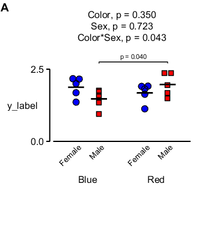

# Two-way linear mixed model

## Requirements

Uses:
+ [MATLAB utilities](http://github.com/Campbell-Muscle-Lab/MATLAB_Utilities)
+ [MATLAB SAS](http://github.com/Campbell-Muscle-Lab/MATLAB_SAS)

## Code

[Source code](https://github.com/Campbell-Muscle-Lab/howtos_making_figures/tree/master/code/stats/two_way_lmm/figure_two_way_lmm.m)

````
function figure_two_way_lmm
% Code runs two-way linear mixed model without grouping

% Variables
data_file_string = 'data/example_data.xlsx';

% Code

% Make a figure with two panels
sp = initialise_publication_quality_figure( ...
    'no_of_panels_wide', 1, ...
    'no_of_panels_high', 1, ...
    'x_to_y_axes_ratio', 2, ...
    'axes_padding_left', 0.8, ...
    'axes_padding_right', 0.2, ...
    'right_margin', 4.5, ...
    'axes_padding_top', 1.2, ...
    'axes_padding_bottom', 1);

% Read data
d = readtable(data_file_string);

% Use two_way_jitter to run the stats and make the figure
two_way_jitter( ...
    'data_table', d, ...
    'test_variable', 'y_label', ...
    'factor_1', 'Color', ...
    'factor_2', 'Sex', ...
    'grouping', 'group', ...
    'calling_path_string', cd, ...
    'axis_handle', sp(1), ...
    'title_y_offset', 1.6, ...
    'y_label_offset', -0.2, ...
    'y_main_label_offset',0.45);
````

## How this works

+ Set variables at top
+ Make a figure with a single panel
+ Uses  two_way_jitter.m to plot data and add results from a two-way linear-mixed-model with grouping

## Output


