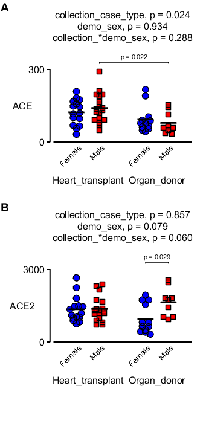

# Two-way nanostring

This example builds on [two_way_lmm](../two_way_lmm/two_way_lmm.html) but loops through an array of variable names running a test on each set of values.

## Requirements

Uses:
+ [MATLAB utilities](http://github.com/Campbell-Muscle-Lab/MATLAB_Utilities)
+ [MATLAB SAS](http://github.com/Campbell-Muscle-Lab/MATLAB_SAS)

## Code

[Source code](https://github.com/Campbell-Muscle-Lab/howtos_making_figures/tree/master/code/stats/two_way_nanostring/two_way_nanostring.m)

````
function figure_two_way_nanostring
% Code runs two-way linear mixed model with grouping

% Variables
data_file_string = 'data/merged_data.xlsx';
gene_names = {'ACE', 'ACE2'};

% Code

% Make a figure with two panels
sp = initialise_publication_quality_figure( ...
    'no_of_panels_wide', 1, ...
    'no_of_panels_high', 2, ...
    'x_to_y_axes_ratio', 2, ...
    'axes_padding_left', 0.8, ...
    'axes_padding_right', 0.2, ...
    'right_margin', 4.5, ...
    'axes_padding_top', 1.2, ...
    'axes_padding_bottom', 1);

% Read data
d = readtable(data_file_string);

% Loop through the gene-names making a two-way graph in each panel
for i = 1:2
    
    two_way_jitter( ...
        'data_table', d, ...
        'test_variable', gene_names{i}, ...
        'factor_1', 'collection_case_type', ...
        'factor_1_strings', {'Heart_transplant','Organ_donor'}, ...
        'factor_2', 'demo_sex', ...
        'grouping', 'hashcode', ...
        'calling_path_string', cd, ...
        'axis_handle', sp(i), ...
        'title_y_offset', 1.6, ...
        'y_label_offset', -0.2, ...
        'y_main_label_offset',0.45);
end
````

## How this works

+ Set variables at top
+ Make a figure with two panels
+ Loop through the panels
  + Using two_way_jitter.m to plot data and add results from a two-way linear-mixed-model with grouping for each genename


## Output




